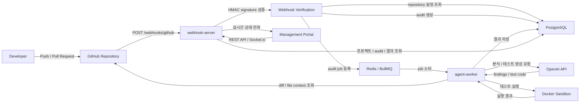

# Src-Audit 팀 공유 문서

작성일: 2026-06-20

이 문서는 팀원에게 Src-Audit 프로젝트의 기획 의도, 기획 내용, 전체 솔루션 흐름, 현재 구현 상태, 시연 방법을 공유하기 위한 발표/데모 가이드입니다.

## 1. 한 줄 소개

Src-Audit는 GitHub에 Push 또는 Pull Request가 발생하면 변경 소스를 자동으로 수집하고, OpenAI 기반 분석과 샌드박스 테스트 실행을 통해 보안/성능/유지보수 리스크를 검출한 뒤, 관리 포탈에서 결과를 확인할 수 있게 하는 AI 코드 감사 솔루션입니다.

## 2. 기획 의도

개발팀의 코드 리뷰와 품질 검증 과정에는 반복적이고 시간이 많이 드는 작업이 많습니다.

- PR마다 변경 diff를 읽고 위험 지점을 찾는다.
- 보안 취약점, 성능 병목, 유지보수성 저하 요소를 사람이 선별한다.
- 변경 코드에 맞는 테스트 관점을 정리한다.
- 테스트 코드를 작성하고 실행한다.
- 리뷰 결과를 팀원이 다시 확인할 수 있도록 기록한다.

이 프로젝트의 기획 의도는 이 반복 업무를 AI와 자동화 파이프라인으로 보조하는 것입니다. 최종 목표는 사람의 리뷰를 대체하는 것이 아니라, 리뷰어가 더 빠르게 위험 지점을 찾고 더 좋은 판단을 할 수 있도록 “초기 분석 자료”와 “검증 가능한 근거”를 제공하는 것입니다.

## 3. 해결하려는 문제

### 3.1 코드 리뷰 병목

리뷰어의 숙련도와 가용 시간에 따라 리뷰 품질이 달라질 수 있습니다. Src-Audit는 모든 Push/PR에 대해 동일한 기준의 1차 점검을 수행해 리뷰 시작점을 맞춥니다.

### 3.2 보안/품질 이슈의 늦은 발견

취약한 입력 검증, 비효율적인 쿼리, 예외 처리 누락 같은 문제는 배포 직전 또는 운영 중에 발견되면 비용이 커집니다. Src-Audit는 변경 이벤트 직후 자동 검사를 수행합니다.

### 3.3 테스트 작성 부담

변경 코드마다 어떤 테스트가 필요한지 판단하고 테스트 코드를 작성하는 일은 시간이 걸립니다. Src-Audit는 AI가 테스트 전략과 테스트 코드를 생성하고, 샌드박스에서 실제 실행해 결과를 남깁니다.

### 3.4 검토 이력의 분산

GitHub 이벤트, 분석 결과, 테스트 결과가 흩어져 있으면 추적이 어렵습니다. Src-Audit는 관리 포탈에서 프로젝트별 감사 이력과 세부 결과를 모아서 보여줍니다.

## 4. 기획서 요약

### 대상 사용자

- 개발자: Push/PR 직후 변경 코드에 대한 빠른 피드백을 받는 사용자
- 리뷰어/리드 개발자: 위험 지점과 테스트 결과를 참고해 리뷰 품질을 높이는 사용자
- QA/보안 담당자: 반복적인 취약점/품질 검사를 자동화하고 이력을 추적하는 사용자
- 관리자: 프로젝트별 감사 현황과 품질 추이를 확인하는 사용자

### 핵심 기능

- GitHub webhook 연동
- repository별 감사 설정 관리
- Push/Pull Request 이벤트 기반 자동 audit 생성
- GitHub diff 및 변경 파일 컨텍스트 수집
- OpenAI 기반 보안/성능/유지보수 분석
- AI finding의 파일 경로, 라인, snippet 근거 검증
- 테스트 전략 및 테스트 코드 생성
- Docker sandbox 기반 테스트 실행
- 감사 결과, finding, 테스트 결과 저장
- 관리 포탈 Dashboard, Audit History, Webhook Events, Statistics, Settings 제공

### 성공 기준

- Push/PR 이벤트가 들어오면 audit이 자동 생성된다.
- agent-worker가 실제 변경 diff를 기반으로 분석을 수행한다.
- AI 분석 결과가 DB에 저장되고 포탈에서 조회된다.
- 생성 테스트가 샌드박스에서 실행되고 결과가 기록된다.
- 팀원이 포탈에서 프로젝트별 감사 이력을 추적할 수 있다.

## 5. 전체 솔루션 구성

Src-Audit는 크게 네 개의 실행 영역으로 구성됩니다.

| 구성 요소 | 역할 |
| --- | --- |
| GitHub | Push/PR 이벤트 발생, webhook 전송, diff 제공 |
| webhook-server | webhook 수신, 서명 검증, 프로젝트/감사 데이터 저장, queue 등록, 포탈 API 제공 |
| agent-worker | queue job 소비, GitHub diff 조회, OpenAI 분석/테스트 생성, sandbox 실행 |
| portal | 프로젝트 등록/설정, 감사 이력/결과/통계/이벤트 조회 |
| PostgreSQL | 프로젝트, audit, 분석 결과, 테스트 결과, webhook 이벤트 저장 |
| Redis/BullMQ | 비동기 audit job queue |
| Docker sandbox | AI 생성 테스트를 격리 환경에서 실행 |

## 6. 전체 흐름도



## 7. Push 이벤트 기준 상세 처리 흐름

1. 개발자가 GitHub repository에 commit을 Push합니다.
2. GitHub webhook이 `POST /webhooks/github`로 이벤트를 전송합니다.
3. `webhook-server`가 raw body와 `x-hub-signature-256`으로 HMAC 서명을 검증합니다.
4. repository URL을 기준으로 등록된 프로젝트 설정을 찾습니다.
5. 프로젝트가 active인지, Push audit이 허용되어 있는지, branch filter에 맞는지 확인합니다.
6. `webhookEvent`와 `audit` 데이터를 PostgreSQL에 저장합니다.
7. audit id를 job id로 사용해 Redis/BullMQ queue에 작업을 등록합니다.
8. `agent-worker`가 queue에서 작업을 가져옵니다.
9. GitHub API와 token을 사용해 diff, 변경 파일, 대상 commit 정보를 조회합니다.
10. worker가 repository를 clone/checkout하고 변경 파일 주변 컨텍스트를 수집합니다.
11. OpenAI에 보안/성능/유지보수 관점 분석을 요청합니다.
12. AI가 반환한 finding의 파일 경로, 라인 범위, source snippet이 실제 변경 내용과 맞는지 검증합니다.
13. OpenAI에 테스트 전략과 테스트 코드 생성을 요청합니다.
14. Docker sandbox에서 dependency install과 테스트 실행을 분리해 수행합니다.
15. 분석 결과와 테스트 결과를 PostgreSQL에 저장합니다.
16. `webhook-server`가 Socket.io로 포탈에 audit 상태 변경을 전파합니다.
17. 팀원은 포탈에서 Audit History와 Audit Detail을 통해 결과를 확인합니다.

## 8. 주요 화면과 사용 시나리오

### 대시보드

프로젝트와 감사 현황을 요약해서 확인합니다. 팀 공유 시 가장 먼저 보여줄 화면입니다.

설명 포인트:

- 등록된 repository 목록
- audit 전체 현황
- 최근 감사 상태
- 실시간 업데이트 연결 상태

### 설정

repository를 등록하고 webhook secret, GitHub token, Push/PR 허용 여부, branch filter 등을 설정합니다.

설명 포인트:

- `Repository GitHub URL`: 감사 대상 repository 주소
- `GitHub Access Key`: private repo checkout, GitHub API 호출, PR comment/check 작성에 사용
- `Webhook Signature Secret`: GitHub webhook 요청이 신뢰 가능한지 검증하기 위한 secret
- `Audit on Pull Requests`: PR 이벤트 감사 허용
- `Audit on Direct Pushes`: Push 이벤트 감사 허용
- `Active`: 해당 repository 감사 활성화 여부

### Webhook 이벤트

GitHub에서 들어온 webhook 이벤트 이력을 확인합니다.

설명 포인트:

- 이벤트가 실제로 수신됐는지 확인
- Push/PR 이벤트 구분
- signature 또는 설정 문제를 추적하는 첫 번째 화면

### 감사 이력

생성된 audit 목록과 상태를 확인합니다.

설명 포인트:

- 이벤트별 audit 생성 여부
- pending/running/completed/failed 상태 흐름
- 두 audit 비교 기능

### 감사 상세

개별 audit의 AI 분석 결과, 테스트 생성/실행 결과, 진단 의견, 추천 해결책을 확인합니다.

설명 포인트:

- finding 분류: security, performance, maintainability
- severity 기준
- 파일/라인/snippet 근거
- 생성 테스트 코드와 실행 로그
- 최종 audit 상태

### 통계

프로젝트별 감사 통계와 추세를 확인합니다.

설명 포인트:

- 프로젝트별 audit 수
- 상태별 분포
- finding severity 분포
- 장기적으로 품질 추이를 보는 화면

## 9. 시연 시나리오

팀 공유 세션에서는 다음 순서로 시연하는 것을 권장합니다.

### 9.1 사전 준비

Docker Compose 서비스 실행:

```bash
docker compose up -d postgres redis webhook-server agent-worker
```

포탈 실행:

```bash
npm run dev --workspace=portal -- --host 0.0.0.0
```

포탈 접속:

```text
http://127.0.0.1:5173
```

주의: 로컬에서 다른 Vite 앱이 `localhost:5173`을 사용하면 잘못된 화면이 열릴 수 있으므로 시연에는 `127.0.0.1:5173`을 사용합니다.

### 9.2 repository 등록 시연

1. 포탈에서 `Settings` 메뉴로 이동합니다.
2. `Add Repository`를 클릭합니다.
3. repository URL을 입력합니다.
4. GitHub token을 입력합니다.
5. `Webhook Signature Secret`을 입력합니다.
6. PR/Push audit 허용 여부를 선택합니다.
7. 저장 후 목록에 repository가 표시되는지 확인합니다.

설명할 핵심:

- 이 설정이 webhook 수신 이후 어떤 repository 설정을 적용할지 결정합니다.
- secret은 GitHub webhook 설정의 Secret과 반드시 같아야 합니다.

### 9.3 GitHub webhook 설정 시연

GitHub repository에서 다음 경로로 이동합니다.

```text
Settings > Webhooks > Add webhook
```

입력값:

```text
Payload URL: https://<외부터널주소>/webhooks/github
Content type: application/json
Secret: 포탈에 입력한 Webhook Signature Secret과 동일한 값
Events: Pushes, Pull requests
```

로컬 개발 환경에서는 GitHub가 `127.0.0.1`에 직접 접근할 수 없으므로 터널이 필요합니다.

cloudflared 예시:

```bash
cloudflared tunnel --url http://127.0.0.1:3001
```

출력 URL이 `https://example.trycloudflare.com`이면 Payload URL은 다음과 같습니다.

```text
https://example.trycloudflare.com/webhooks/github
```

계정 전체 repository를 대상으로 시연하려면 `src-audit.config.json`의 `https://github.com/kchul199/*` 설정을 사용합니다. 이 설정은 `kchul199` 계정의 모든 repository에서 들어오는 Push/PR webhook을 허용하고, 첫 이벤트가 들어온 repository를 실제 프로젝트로 자동 생성합니다.

단, GitHub가 이벤트를 보내려면 GitHub 쪽 설정도 필요합니다. 개인 계정 전체를 한 번에 처리하려면 GitHub App을 모든 repository에 설치하거나, 각 repository에 동일한 Payload URL과 Secret으로 webhook을 등록해야 합니다.

### 9.4 webhook ping 확인

GitHub Webhook 화면의 `Recent Deliveries`에서 ping 결과를 확인합니다.

정상 기준:

- ping 이벤트 응답이 `200 pong`
- Push/PR 이벤트 응답이 `202 Accepted`

문제가 있으면 먼저 확인할 것:

- Payload URL이 `/webhooks/github`까지 포함되어 있는가?
- secret이 포탈 설정과 같은가?
- `webhook-server`가 `3001` 포트에서 실행 중인가?
- 외부 터널 프로세스가 계속 살아 있는가?

### 9.5 Push 이벤트로 audit 생성 시연

1. 대상 repository에 작은 변경을 commit합니다.
2. GitHub에 Push합니다.
3. GitHub Webhook Recent Deliveries에서 Push 이벤트가 성공했는지 확인합니다.
4. 포탈 `Webhook Events`에서 이벤트 수신 여부를 확인합니다.
5. 포탈 `Audit History`에서 새 audit이 생성됐는지 확인합니다.
6. worker 처리 완료 후 `Audit Detail`에서 AI finding과 테스트 결과를 확인합니다.

시연 중 함께 볼 로그:

```bash
docker compose logs --no-color --tail=120 webhook-server
docker compose logs --no-color --tail=120 agent-worker
```

## 10. 현재까지 구현/개선된 내용

### Webhook/Backend 영역

- GitHub webhook raw body 기반 HMAC 검증
- repository별 `webhookSecret` 우선 적용
- `.git` suffix가 있는 URL과 없는 URL을 같은 repository로 매칭
- 중복 repository URL 등록 시 `409 Repository URL is already registered` 반환
- project 삭제 시 하위 audit/result 데이터를 트랜잭션으로 정리
- queue job id를 audit id로 고정해 중복 enqueue 방지
- 포탈용 project/audit/webhook/statistics API 제공

### Agent Worker 영역

- 실제 GitHub diff 조회
- repository clone/checkout 기반 소스 컨텍스트 수집
- full diff 보존 및 LLM 입력 제한
- 변경 파일/라인 기반 context 구성
- AI finding의 path, line range, source snippet 검증
- snippet 근거가 약한 finding은 manual review 수준으로 낮춤
- 테스트 전략 생성 후 Jest/Vitest/Mocha/node:test/pytest/go test runner 선택
- project validation failure를 최종 audit 실패로 반영
- GitHub Check 결과 생성 경로 준비

### 샌드박스 영역

- dependency install 단계와 generated test 실행 단계 분리
- project validation command 실행 지원
- sandbox test 단계 네트워크 차단
- read-only rootfs, capability drop, no-new-privileges 등 하드닝 적용
- Go 테스트는 변경 파일이 있는 패키지 디렉터리 기준으로 실행

### 포탈 영역

- Dashboard, Audit History, Webhook Events, Statistics, Settings 화면 구현
- Add Repository 실패 시 모달을 닫지 않고 오류를 표시하도록 개선
- API 서버 미기동/연결 실패 원인을 더 명확히 표시
- Settings CRUD 실제 API 검증
- 감사 상세 화면에서 finding, 테스트 결과, 진단 의견, 추천 해결책 표시

## 11. 운영 확인 명령

서비스 상태:

```bash
docker compose ps
```

webhook-server health:

```bash
curl -fsS http://127.0.0.1:3001/health
```

외부 터널 health:

```bash
curl -fsS https://<터널주소>/health
```

포탈 검증:

```bash
npm run lint --workspace=portal
npm run build --workspace=portal
```

전체 TypeScript 검증:

```bash
npx tsc --noEmit
```

## 12. 자주 묻는 질문

### Webhook Signature Secret은 무엇인가?

GitHub가 보낸 webhook 요청이 실제 GitHub 설정에서 온 것인지 확인하기 위한 공유 비밀값입니다. GitHub Webhook 설정의 Secret과 Src-Audit 포탈 Settings의 `Webhook Signature Secret`이 같아야 합니다.

### Payload URL은 무엇을 넣어야 하나?

GitHub가 webhook을 보낼 외부 접근 가능한 URL입니다. 로컬 개발 환경에서는 터널 주소 뒤에 `/webhooks/github`를 붙입니다.

예:

```text
https://example.trycloudflare.com/webhooks/github
```

### Push하면 바로 소스 검증이 동작하나?

다음 조건이 모두 맞으면 동작합니다.

1. `webhook-server`, `agent-worker`, PostgreSQL, Redis가 실행 중입니다.
2. GitHub webhook Payload URL이 외부에서 접근 가능합니다.
3. GitHub Secret과 포탈 Secret이 일치합니다.
4. repository가 포탈 Settings에 등록되어 있고 Active 상태입니다.
5. 또는 `https://github.com/kchul199/*` 같은 owner-wide 설정이 Active 상태입니다.
6. `Audit on Direct Pushes`가 켜져 있습니다.
7. branch filter가 있다면 Push branch가 조건에 맞습니다.
8. `OPENAI_API_KEY`와 `GITHUB_TOKEN`이 유효합니다.

### kchul199 계정의 모든 repository를 감사할 수 있나?

서버는 `https://github.com/kchul199/*` owner-wide 설정을 지원합니다. 따라서 `kchul199` 계정의 어떤 repository에서 webhook이 들어와도 Push/PR 감사 대상으로 처리하고, 실제 repository 프로젝트를 자동 생성합니다.

다만 GitHub 개인 계정 전체 webhook은 서버 설정만으로 자동 발생하지 않습니다. GitHub App을 모든 repository에 설치하거나 각 repository에 동일한 webhook을 등록해야 실제 이벤트가 Src-Audit로 전달됩니다.

### Add Repository가 안 되면 무엇을 확인하나?

- `webhook-server`가 떠 있는지 확인합니다.
- `http://127.0.0.1:3001/health`가 응답하는지 확인합니다.
- 같은 repository URL이 이미 등록되어 있지 않은지 확인합니다.
- 중복이면 `409 Repository URL is already registered` 응답이 반환됩니다.

## 13. 현재 한계와 후속 과제

현재 구현은 로컬/개발 환경에서 실제 webhook, OpenAI 호출, sandbox 실행까지 이어지는 흐름을 검증하는 데 초점을 맞추고 있습니다. 팀 단위 운영 또는 프로덕션 적용 전에는 다음 과제가 남아 있습니다.

- 고정 도메인 기반 webhook endpoint 구성
- GitHub App 기반 권한 모델 정리
- Check Run/PR comment 권한과 실패 처리 고도화
- audit job 분산 lock 도입
- sandbox runner 분리 및 Docker socket 의존성 축소
- sandbox image digest pinning
- OpenAI 호출 비용/timeout/retry 정책 정교화
- finding 오탐/미탐 평가용 benchmark repository 구성
- 포탈 인증/권한 관리
- 운영 모니터링, 알림, 로그 보존 정책

## 14. 팀 공유 발표 흐름 제안

발표는 25~35분 정도를 기준으로 다음 흐름을 권장합니다.

1. 문제 정의: 왜 자동 코드 감사가 필요한가
2. 제품 소개: Src-Audit가 어떤 역할을 하는가
3. 기획 요약: 대상 사용자, 핵심 기능, 성공 기준
4. 아키텍처 설명: GitHub, webhook-server, queue, worker, OpenAI, sandbox, portal 흐름
5. 포탈 화면 설명: 대시보드, 설정, webhook 이벤트, 감사 이력, 감사 상세, 통계
6. 실제 시연: repository 등록, webhook 설정, Push 이벤트, audit 결과 확인
7. 현재 구현 상태: 완료된 기능과 검증된 범위
8. 남은 과제: 운영화, 보안 하드닝, 정확도 개선, GitHub App 전환
9. 질의응답: 팀 적용 가능성과 우선순위 논의

## 15. 팀원 체크리스트

시연 전 확인:

1. `.env`에 `OPENAI_API_KEY`, `GITHUB_TOKEN`, `GITHUB_WEBHOOK_SECRET`이 있는가?
2. `docker compose ps`에서 postgres, redis, webhook-server, agent-worker가 실행 중인가?
3. 포탈이 `http://127.0.0.1:5173`에서 열리는가?
4. Settings에 대상 repository가 등록되어 있는가?
5. 계정 전체 시연이면 `https://github.com/kchul199/*` 설정이 Active인가?
6. GitHub webhook Secret과 포탈 Secret 또는 `GITHUB_WEBHOOK_SECRET`이 같은가?
7. Payload URL이 외부 접근 가능한 `/webhooks/github` 주소인가?
8. GitHub Recent Deliveries에서 ping 또는 Push 이벤트 성공 응답이 보이는가?
9. Audit History에 새 audit이 생성되는가?
10. Audit Detail에서 finding과 테스트 결과를 확인할 수 있는가?
