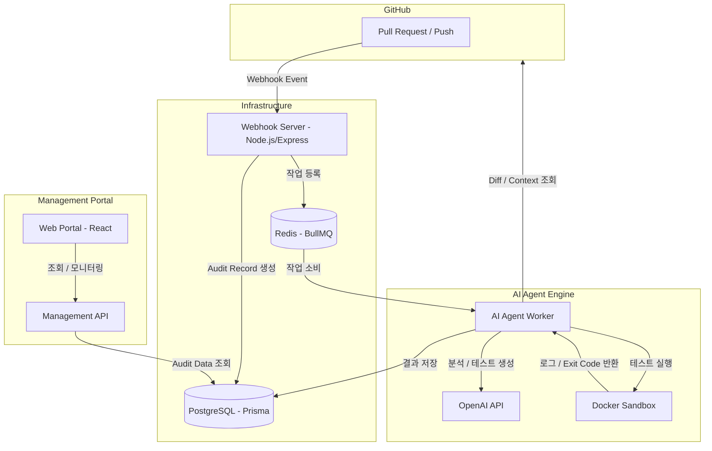

# 기술 설계 문서 - Src-Audit

## 1. 시스템 아키텍처

Src-Audit는 GitHub 이벤트를 비동기 queue로 처리하는 AI 코드 감사 시스템입니다. webhook 수신과 audit 실행을 분리해, GitHub 이벤트 응답은 빠르게 처리하고 OpenAI 호출과 sandbox 실행은 worker에서 비동기로 수행합니다.



## 2. 데이터베이스 설계

### 핵심 모델

- **Project**: 감사 대상 repository 설정
- **Audit**: 특정 Push/PR 이벤트에 대한 감사 실행 기록
- **AnalysisResult**: AI 코드 리뷰 결과
- **TestResult**: 생성 테스트 코드와 실행 결과
- **HealingIteration**: 실패한 테스트를 AI가 수정하려고 시도한 반복 기록
- **WebhookEvent**: GitHub webhook 수신 이력

### Prisma Schema 요약

```prisma
model Project {
  id             String   @id @default(cuid())
  name           String
  repoUrl        String   @unique
  githubToken    String?
  webhookSecret  String?
  allowPRs       Boolean  @default(true)
  allowPush      Boolean  @default(false)
  active         Boolean  @default(true)
  audits         Audit[]
  createdAt      DateTime @default(now())
}

model Audit {
  id              String           @id @default(cuid())
  projectId       String
  project         Project          @relation(fields: [projectId], references: [id])
  event           String
  ref             String
  commitHash      String
  status          AuditStatus      @default(PENDING)
  analysisResults AnalysisResult[]
  testResults     TestResult[]
  startedAt       DateTime?
  completedAt     DateTime?
  createdAt       DateTime         @default(now())
}

model AnalysisResult {
  id            String   @id @default(cuid())
  auditId       String
  category      String
  severity      String
  filePath      String
  lineRange     String?
  sourceSnippet String?
  description   String
  suggestion    String?
  createdAt     DateTime @default(now())
}

model TestResult {
  id             String     @id @default(cuid())
  auditId        String
  testCode       String
  status         TestStatus @default(RUNNING)
  exitCode       Int?
  stdout         String?
  stderr         String?
  iterationCount Int        @default(1)
  errorAnalysis  String?
  createdAt      DateTime   @default(now())
}
```

## 3. AI 에이전트 처리 흐름

`agent-worker`는 queue에서 audit job을 가져온 뒤 다음 상태 흐름으로 처리합니다.

### 3.1 컨텍스트 수집

- GitHub API로 Push/PR diff를 조회합니다.
- 대상 repository를 clone하고 audit 대상 commit으로 checkout합니다.
- 변경 파일 주변의 실제 소스 컨텍스트를 수집합니다.
- `README.md`, `GEMINI.md`, `package.json` 등 프로젝트 지침과 의존성 정보를 참고합니다.

### 3.2 AI 분석

- OpenAI에 diff, 파일 컨텍스트, 프로젝트 지침을 전달합니다.
- 보안, 성능, 유지보수성 관점의 finding을 JSON 형태로 받습니다.
- 각 finding의 path, line range, source snippet이 실제 변경 내용과 맞는지 검증합니다.
- 근거가 약한 finding은 severity 또는 review level을 조정합니다.

### 3.3 테스트 생성

- 분석 결과와 변경 파일 정보를 바탕으로 테스트 전략을 생성합니다.
- 프로젝트의 언어와 테스트 도구를 감지합니다.
- Jest, Vitest, Mocha, node:test, pytest, go test 등 가능한 runner를 선택합니다.
- 외부 API, DB, 파일 시스템 접근은 mock 또는 격리 실행을 우선합니다.

### 3.4 샌드박스 실행

- 의존성 설치 컨테이너와 테스트 실행 컨테이너를 분리합니다.
- 설치 단계에는 필요한 네트워크 접근을 허용합니다.
- 테스트 실행 단계는 네트워크를 차단합니다.
- 생성 테스트를 실행하고 stdout, stderr, exit code를 수집합니다.
- 실패 시 OpenAI에 실패 로그와 테스트 코드를 전달해 수정 후보를 생성합니다.
- self-healing은 제한된 횟수만 반복합니다.

### 3.5 결과 저장

- 최종 finding, 생성 테스트 코드, 실행 로그, healing iteration을 DB에 저장합니다.
- audit 상태를 `COMPLETED` 또는 `FAILED`로 갱신합니다.
- 필요 시 GitHub Check 또는 PR comment 경로로 결과를 전달합니다.

## 4. API 설계

### Webhook API

#### `POST /webhooks/github`

- GitHub webhook 요청을 수신합니다.
- `x-hub-signature-256` 기반 HMAC 서명을 검증합니다.
- Push/PR payload를 파싱합니다.
- repository 설정을 조회합니다.
- audit record를 생성하고 queue에 job을 등록합니다.

### 관리 포탈 API

#### `GET /api/projects`

등록된 프로젝트 목록을 조회합니다.

#### `POST /api/projects`

새 repository 설정을 등록합니다.

#### `PUT /api/projects/:id`

repository 설정을 수정합니다.

#### `DELETE /api/projects/:id`

repository 설정과 연결된 audit/result 데이터를 삭제합니다.

#### `GET /api/audits`

audit 목록을 페이지네이션으로 조회합니다.

#### `GET /api/audits/:id`

audit 상세 결과를 조회합니다.

#### `POST /api/audits/:id/retry`

audit을 수동 재실행합니다.

#### `GET /api/webhook-events`

수신된 webhook 이벤트 이력을 조회합니다.

#### `GET /api/statistics`

프로젝트별 audit 상태와 finding 통계를 조회합니다.

## 5. 보안 및 샌드박스 설계

### Webhook 보안

- raw body 기반 HMAC signature를 검증합니다.
- repository별 `webhookSecret`을 우선 사용합니다.
- secret이 없거나 signature가 맞지 않으면 요청을 거부합니다.

### Token 보안

- GitHub token은 repository checkout, diff 조회, 결과 작성에 사용됩니다.
- 로그에 token이 노출되지 않도록 오류 메시지를 sanitize합니다.
- 운영 환경에서는 GitHub App 기반 최소 권한 token 사용을 권장합니다.

### 샌드박스 격리

- 테스트 실행 단계는 Docker `NetworkMode: none`을 사용합니다.
- root filesystem은 읽기 전용으로 실행합니다.
- `/tmp` 등 필요한 임시 영역만 쓰기 가능하게 둡니다.
- memory/cpu 제한을 적용합니다.
- Linux capability를 drop하고 `no-new-privileges`를 적용합니다.
- 컨테이너는 완료 또는 timeout 이후 정리합니다.

## 6. 운영 고려 사항

- GitHub webhook을 로컬에서 받으려면 `cloudflared` 또는 `ngrok` 터널이 필요합니다.
- account-less quick tunnel URL은 임시 URL이므로 팀 시연 후 바뀔 수 있습니다.
- OpenAI 호출 실패, GitHub rate limit, sandbox dependency install 실패는 audit 실패로 기록해야 합니다.
- 운영 배포 전에는 Docker socket 직접 mount를 줄이고 별도 sandbox runner를 고려해야 합니다.
- 포탈에는 인증/권한 관리가 추가되어야 합니다.
